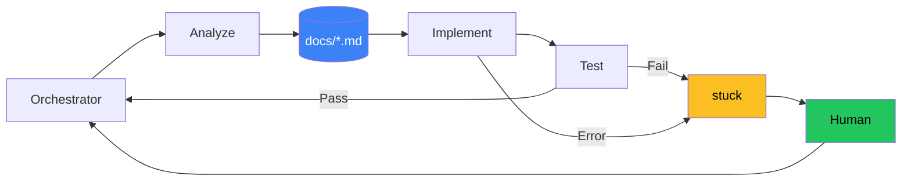
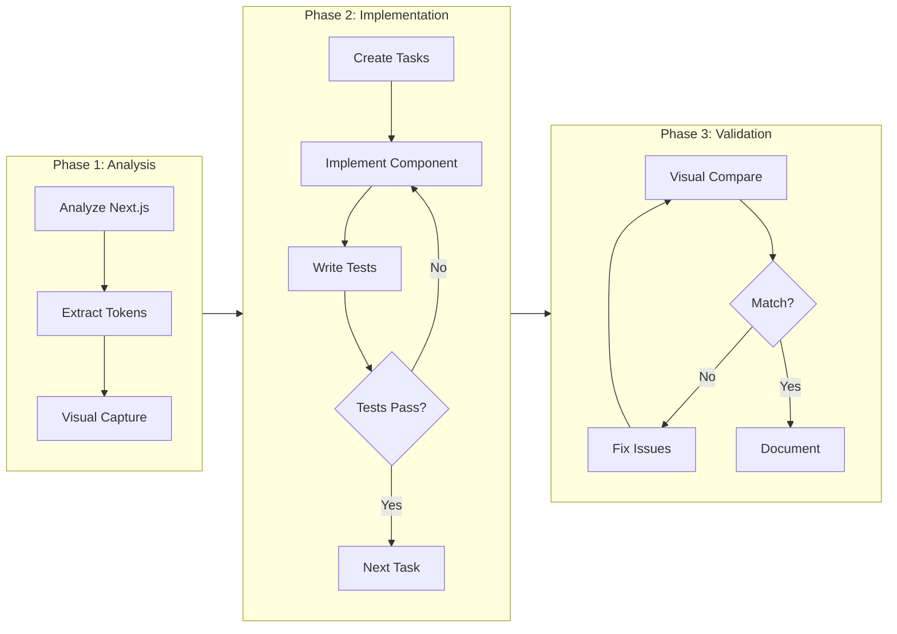

# Next.js to Nuxt 4 Migration

## Leveraging Claude Code & Specialized Agents

<div class="pt-12">
  <span class="px-2 py-1 rounded cursor-pointer">
    <carbon-logo-vue class="inline text-green-500 text-2xl" /> Nuxt 4 &nbsp;|&nbsp;
    <logos-nuxt-icon class="inline text-2xl" /> NuxtUI 4.4 &nbsp;|&nbsp;
    <logos-tailwindcss-icon class="inline text-2xl" /> Tailwind CSS 4
  </span>
</div>

<div class="abs-br m-6 flex gap-2">
  <a href="https://github.com/krank56" target="_blank" class="text-xl slidev-icon-btn opacity-50 !border-none !hover:text-white">
    <carbon-logo-github />
  </a>
</div>

<!--
Welcome to my presentation on migrating a production Next.js application to Nuxt 4 using Claude Code with specialized agents.
-->

---
layout: section
---

# Context

<mdi-information-outline class="text-4xl text-blue-400" />

Understanding the project scope

---
layout: two-cols-header
---

# Source → Target

::left::

<div class="text-center mb-6">
<logos-react class="text-6xl" />
<div class="text-2xl font-bold mt-2">Next.js 15.5</div>
</div>

<div class="space-y-3 text-sm">
  <div class="flex items-center gap-3">
    <logos-react class="text-xl" />
    <span>React 19</span>
  </div>
  <div class="flex items-center gap-3">
    <logos-sass class="text-xl" />
    <span>SCSS Modules</span>
  </div>
  <div class="flex items-center gap-3">
    <mdi-state-machine class="text-xl text-blue-400" />
    <span>React Context</span>
  </div>
  <div class="flex items-center gap-3">
    <logos-jest class="text-xl" />
    <span>Jest</span>
  </div>
  <div class="flex items-center gap-3">
    <logos-npm-icon class="text-xl" />
    <span>npm</span>
  </div>
</div>

<div class="mt-6 text-center border-t border-gray-700 pt-4">
<div class="text-3xl font-bold text-gray-400">25+ pages</div>
<div class="text-sm text-gray-500">200+ components</div>
</div>

::right::

<div class="text-center mb-6">
<logos-nuxt-icon class="text-6xl" />
<div class="text-2xl font-bold mt-2">Nuxt 4.3</div>
</div>

<div class="space-y-3 text-sm">
  <div class="flex items-center gap-3">
    <logos-vue class="text-xl" />
    <span>Vue 3</span>
  </div>
  <div class="flex items-center gap-3">
    <logos-tailwindcss-icon class="text-xl" />
    <span>Tailwind 4 + NuxtUI 4.4</span>
  </div>
  <div class="flex items-center gap-3">
    <logos-pinia class="text-xl" />
    <span>Pinia + useState</span>
  </div>
  <div class="flex items-center gap-3">
    <logos-vitest class="text-xl" />
    <span>Vitest + Playwright</span>
  </div>
  <div class="flex items-center gap-3">
    <logos-pnpm class="text-xl" />
    <span>pnpm</span>
  </div>
</div>

<div class="mt-6 text-center border-t border-gray-700 pt-4">
</div>

---
layout: section
---

# Methodology

<mdi-cog class="text-4xl text-orange-400 animate-spin" />

The Agent-Based Approach

---

# The Nail Factory Problem

<div class="grid grid-cols-2 gap-8 mt-4">

<div>

### Traditional Approach

<mdi-factory class="text-6xl text-gray-400 mb-4" />

<v-clicks>

- One worker does **everything**
- Context switching overhead
- Limited specialization
- Sequential processing
- **Bottleneck: Single agent context**

</v-clicks>

</div>

<div>

### Toyotism / Agent Approach

<mdi-robot-industrial class="text-6xl text-green-400 mb-4" />

<v-clicks>

- **Specialized agents** for each task
- Optimized context windows
- Parallel execution possible
- Assembly line efficiency
- **Key: Right tool for right job**

</v-clicks>

</div>

</div>

<!--
Just like Toyota revolutionized manufacturing with specialized workstations, we use specialized agents optimized for specific tasks.
-->

---

# The 5 Sins of AI-Assisted Development

<div class="grid grid-cols-2 gap-x-8 gap-y-4 mt-6 text-sm">

<div v-click class="flex items-start gap-3">
  <mdi-brain class="text-2xl text-red-400 flex-shrink-0 mt-1" />
  <div>
    <div class="font-bold text-red-400">1. Hallucination</div>
    <div class="text-gray-400">AI invents APIs, methods, or patterns that don't exist</div>
  </div>
</div>

<div v-click class="flex items-start gap-3">
  <mdi-calendar-clock class="text-2xl text-orange-400 flex-shrink-0 mt-1" />
  <div>
    <div class="font-bold text-orange-400">2. Stale Knowledge</div>
    <div class="text-gray-400">Training cutoff means outdated framework patterns</div>
  </div>
</div>

<div v-click class="flex items-start gap-3">
  <mdi-compass-off class="text-2xl text-yellow-400 flex-shrink-0 mt-1" />
  <div>
    <div class="font-bold text-yellow-400">3. Context Drift</div>
    <div class="text-gray-400">Long sessions lose focus, forget earlier decisions</div>
  </div>
</div>

<div v-click class="flex items-start gap-3">
  <mdi-head-question class="text-2xl text-purple-400 flex-shrink-0 mt-1" />
  <div>
    <div class="font-bold text-purple-400">4. Assumption Spiral</div>
    <div class="text-gray-400">AI assumes instead of asking, compounds errors</div>
  </div>
</div>

<div v-click class="flex items-start gap-3 col-span-2 justify-center">
  <mdi-eye-off class="text-2xl text-pink-400 flex-shrink-0 mt-1" />
  <div>
    <div class="font-bold text-pink-400">5. Blind Confidence</div>
    <div class="text-gray-400">AI can't visually verify its own output works</div>
  </div>
</div>

</div>

---

# How We Mitigate These Flaws

<div class="grid grid-cols-2 gap-4 mt-4 text-sm">

<div v-click class="border border-red-500/50 rounded-lg p-3 bg-red-900/10">
  <div class="flex items-center gap-2 mb-2">
    <mdi-brain class="text-red-400" />
    <span class="font-bold">Hallucination</span>
    <mdi-arrow-right class="text-gray-500" />
    <mdi-check-circle class="text-green-400" />
  </div>
  <div class="text-gray-400"><strong class="text-green-400">TDD + tester agent</strong> — fake APIs fail tests, Chrome MCP catches broken UI</div>
</div>

<div v-click class="border border-orange-500/50 rounded-lg p-3 bg-orange-900/10">
  <div class="flex items-center gap-2 mb-2">
    <mdi-calendar-clock class="text-orange-400" />
    <span class="font-bold">Stale Knowledge</span>
    <mdi-arrow-right class="text-gray-500" />
    <mdi-check-circle class="text-green-400" />
  </div>
  <div class="text-gray-400"><strong class="text-green-400">Context7 MCP</strong> fetches current docs (Nuxt 4, NuxtUI 4.4, Tailwind 4)</div>
</div>

<div v-click class="border border-yellow-500/50 rounded-lg p-3 bg-yellow-900/10">
  <div class="flex items-center gap-2 mb-2">
    <mdi-compass-off class="text-yellow-400" />
    <span class="font-bold">Context Drift</span>
    <mdi-arrow-right class="text-gray-500" />
    <mdi-check-circle class="text-green-400" />
  </div>
  <div class="text-gray-400"><strong class="text-green-400">Specialized agents</strong> with minimal scope = focused context windows</div>
</div>

<div v-click class="border border-purple-500/50 rounded-lg p-3 bg-purple-900/10">
  <div class="flex items-center gap-2 mb-2">
    <mdi-head-question class="text-purple-400" />
    <span class="font-bold">Assumption Spiral</span>
    <mdi-arrow-right class="text-gray-500" />
    <mdi-check-circle class="text-green-400" />
  </div>
  <div class="text-gray-400"><strong class="text-green-400">stuck agent</strong> forces escalation instead of guessing</div>
</div>

<div v-click class="border border-pink-500/50 rounded-lg p-3 bg-pink-900/10 col-span-2">
  <div class="flex items-center gap-2 mb-2">
    <mdi-eye-off class="text-pink-400" />
    <span class="font-bold">Blind Confidence</span>
    <mdi-arrow-right class="text-gray-500" />
    <mdi-check-circle class="text-green-400" />
  </div>
  <div class="text-gray-400"><strong class="text-green-400">Chrome MCP</strong> lets agents visually verify output via screenshots & DOM snapshots</div>
</div>

</div>

---
layout: center
class: text-center
---

<div v-click class="text-2xl text-gray-400 uppercase tracking-widest mb-4">
  Introducing...
</div>

<div v-click class="text-6xl font-bold mb-8">
  <span class="text-transparent bg-clip-text bg-gradient-to-r from-blue-400 via-purple-500 to-pink-500">
    SSAABMUIDC
  </span>
  <span class="text-2xl align-super">™</span>
</div>

<div v-click class="text-xl text-gray-300 mb-4">
  <em>Wait... what?</em>
</div>

<v-clicks>

<div class="text-2xl font-light tracking-wide">
  <span class="text-blue-400">S</span>uper
  <span class="text-blue-400">S</span>pecialized
  <span class="text-purple-400">A</span>I
  <span class="text-purple-400">A</span>gent
  <span class="text-pink-400">B</span>ased
</div>

<div class="text-2xl font-light tracking-wide">
  <span class="text-pink-400">M</span>inimal
  <span class="text-orange-400">U</span>ser
  <span class="text-orange-400">I</span>nteraction
  <span class="text-green-400">D</span>evelopment
  <span class="text-green-400">C</span>ycle
</div>

</v-clicks>

<div v-click class="mt-8 text-gray-500 text-sm">
  <mdi-trademark class="inline" /> Patent pending (not really)
</div>

---

# SSAABMUIDC™ in Action



<div class="grid grid-cols-2 gap-8 mt-4">
<div class="border border-gray-600 rounded-lg p-4">
<mdi-robot class="text-2xl text-blue-400" /> <strong>Autonomous Loop</strong>
<div class="text-sm text-gray-400 mt-2">Orchestrator → Analyze → Docs → Implement → Test → Repeat</div>
</div>
<div class="border border-yellow-600 rounded-lg p-4">
<mdi-human class="text-2xl text-yellow-400" /> <strong>Escape Hatch</strong>
<div class="text-sm text-gray-400 mt-2">Only on failure: stuck agent → Human → Back to loop</div>
</div>
</div>

---

# Specialized Agents Architecture

<div class="flex items-center justify-center gap-4 mt-4">
  <div class="border-2 border-purple-500 rounded-xl p-4 text-center bg-purple-900/30">
    <mdi-brain class="text-4xl text-purple-400" />
    <div class="font-bold mt-2">Orchestrator</div>
    <div class="text-xs text-gray-400">TaskList + Delegation</div>
  </div>
  <mdi-arrow-right class="text-3xl text-gray-500" />
  <div class="grid grid-cols-3 gap-3">
    <div class="border border-blue-500 rounded-lg p-2 text-center text-xs bg-blue-900/20">
      <mdi-magnify class="text-xl text-blue-400" />
      <div>Analyzers</div>
    </div>
    <div class="border border-green-500 rounded-lg p-2 text-center text-xs bg-green-900/20">
      <mdi-code-braces class="text-xl text-green-400" />
      <div>Implementers</div>
    </div>
    <div class="border border-orange-500 rounded-lg p-2 text-center text-xs bg-orange-900/20">
      <mdi-check-decagram class="text-xl text-orange-400" />
      <div>Validators</div>
    </div>
  </div>
  <mdi-arrow-right class="text-3xl text-gray-500" />
  <div class="grid grid-cols-1 gap-2">
    <div class="border border-cyan-500 rounded-lg p-2 text-center text-xs bg-cyan-900/20">
      <mdi-file-document class="text-xl text-cyan-400" />
      <div>docs/*.md</div>
    </div>
    <div class="border border-green-500 rounded-lg p-2 text-center text-xs bg-green-900/20">
      <logos-nuxt-icon class="text-xl" />
      <div>Nuxt Code</div>
    </div>
  </div>
</div>

<div class="grid grid-cols-3 gap-4 mt-6 text-xs">
  <div class="text-center">
    <div class="text-blue-400 font-bold mb-1">Analyzers</div>
    <div class="text-gray-400">nextjs-analyzer</div>
    <div class="text-gray-400">visual-analyzer</div>
    <div class="text-gray-400">design-token-extractor</div>
  </div>
  <div class="text-center">
    <div class="text-green-400 font-bold mb-1">Implementers</div>
    <div class="text-gray-400">nuxt-implementer</div>
    <div class="text-gray-400">nuxt-refactorer</div>
    <div class="text-gray-400">coder</div>
  </div>
  <div class="text-center">
    <div class="text-orange-400 font-bold mb-1">Validators</div>
    <div class="text-gray-400">comparison-tester</div>
    <div class="text-gray-400">tester</div>
    <div class="text-yellow-400">stuck → Human</div>
  </div>
</div>

---

# Agent Specialization Benefits

<div class="grid grid-cols-3 gap-4 mt-8">

<div class="border rounded-lg p-4 text-center">
<mdi-magnify class="text-4xl text-blue-400 mb-2" />

### Analyzers
- `nextjs-analyzer`
- `visual-analyzer`
- `design-token-extractor`

**Focus:** Read-only exploration
</div>

<div class="border rounded-lg p-4 text-center">
<mdi-code-braces class="text-4xl text-green-400 mb-2" />

### Implementers
- `nuxt-implementer`
- `nuxt-refactorer`
- `coder`

**Focus:** Write code with TDD
</div>

<div class="border rounded-lg p-4 text-center">
<mdi-check-circle class="text-4xl text-purple-400 mb-2" />

### Validators
- `comparison-tester`
- `tester`
- `stuck`

**Focus:** QA & escalation
</div>

</div>

---

# Analyzer Agents (Read-Only)

<div class="text-sm">

| Agent | Purpose | Tools | Model |
|-------|---------|-------|-------|
| `nextjs-analyzer` | Inventory pages, components, API routes from source codebase | `Read`, `Grep`, `Glob` | <mdi-creation class="inline text-purple-400" /> Sonnet |
| `visual-analyzer` | Navigate live app with Chrome MCP, capture screenshots, document UI patterns | `Read`, `Write`, `Chrome MCP` | <mdi-creation class="inline text-purple-400" /> Sonnet |
| `design-token-extractor` | Extract colors, typography, spacing from SCSS files | `Read`, `Grep`, `Glob`, `Write` | <mdi-creation class="inline text-purple-400" /> Sonnet |

</div>

<v-click>

<div class="mt-6 border border-blue-500 rounded-lg p-4 bg-blue-900/20">
<mdi-shield-check class="inline text-blue-400" /> <strong>Key principle:</strong> No write access to source code - safe exploration only
</div>

</v-click>

---

# Implementer Agents (Code Writers)

<div class="text-sm">

| Agent | Purpose | Tools | Model |
|-------|---------|-------|-------|
| `nuxt-implementer` | Implement components/pages using TDD with Vitest | `Read`, `Write`, `Edit`, `Glob`, `Grep`, `Bash` | <logos-anthropic-icon class="inline invert" /> Opus |
| `nuxt-refactorer` | Refactor code, extract Pinia stores, optimize NuxtUI usage | `Read`, `Write`, `Edit`, `Glob`, `Grep`, `Bash`, `Context7` | <logos-anthropic-icon class="inline invert" /> Opus |
| `coder` | General implementation for specific todo items | `Read`, `Write`, `Edit`, `Glob`, `Grep`, `Bash`, `Context7` | <mdi-creation class="inline text-purple-400" /> Sonnet |

</div>

<v-click>

<div class="mt-6 border border-green-500 rounded-lg p-4 bg-green-900/20">
<mdi-test-tube class="inline text-green-400" /> <strong>TDD approach:</strong> Write tests first, then implement until tests pass
</div>

</v-click>

---

# Validator & Utility Agents

<div class="text-sm">

| Agent | Purpose | Tools | Model |
|-------|---------|-------|-------|
| `comparison-tester` | Side-by-side visual comparison between Next.js and Nuxt apps | `Read`, `Write`, `Edit`, `Bash` | <mdi-creation class="inline text-purple-400" /> Sonnet |
| `tester` | Visual QA using Chrome MCP to verify implementations | `Read`, `Write`, `Chrome MCP` (full) | <mdi-creation class="inline text-purple-400" /> Sonnet |
| `stuck` | **Human escalation** - the ONLY agent that can ask user questions | `AskUserQuestion`, `Read`, `Glob`, `Grep` | <mdi-lightning-bolt class="inline text-yellow-400" /> Haiku |

</div>

<v-click>

<div class="mt-6 border border-purple-500 rounded-lg p-4 bg-purple-900/20">
<mdi-human-greeting class="inline text-purple-400" /> <strong>Escalation path:</strong> When blocked → `stuck` agent → User decision
</div>

</v-click>

---

# Model Selection Strategy

<div class="grid grid-cols-3 gap-6 mt-8">

<div>

### <logos-anthropic-icon class="inline invert" /> Opus

<v-clicks>

- Complex implementation tasks
- `nuxt-implementer`
- `nuxt-refactorer`
- Best for TDD & architecture

</v-clicks>

</div>

<div>

### <mdi-creation class="inline text-purple-400" /> Sonnet

<v-clicks>

- Analysis & testing tasks
- `coder`, `tester`
- `nextjs-analyzer`
- `comparison-tester`
- Balance of speed & quality

</v-clicks>

</div>

<div>

### <mdi-lightning-bolt class="inline text-yellow-400" /> Haiku

<v-clicks>

- Simple escalation tasks
- `stuck` agent only
- Minimal context needed
- Cost optimization

</v-clicks>

</div>

</div>

<v-click>

<div class="mt-6 text-center text-gray-400">
Model choice based on task complexity: <strong>Opus</strong> for implementation, <strong>Sonnet</strong> for analysis, <strong>Haiku</strong> for escalation
</div>

</v-click>

---

# MCP Servers Integration

<div class="grid grid-cols-2 gap-8 mt-8">

<div class="border border-blue-500 rounded-lg p-6">

### <mdi-book-open-page-variant class="inline text-blue-400" /> Context7

<v-clicks>

- **Up-to-date documentation** retrieval
- Library-specific queries
- Nuxt, NuxtUI, Tailwind, Vue docs
- Eliminates outdated knowledge
- `resolve-library-id` + `query-docs`

</v-clicks>

</div>

<div class="border border-orange-500 rounded-lg p-6">

### <mdi-google-chrome class="inline text-orange-400" /> Chrome DevTools

<v-clicks>

- **Visual comparison** testing
- Screenshot capture
- DOM snapshot analysis
- Navigation automation
- Side-by-side validation

</v-clicks>

</div>

</div>

<!--
Context7 ensures we always use current API patterns. Chrome MCP enables visual regression testing.
-->

---

# Iteration Workflow



---
layout: two-cols-header
---

# UI Components First: The `/ui-demo` Page

After token extraction, we build **base UI components** and showcase them on a dedicated demo page for user validation.

::left::

<v-clicks>

### Why This Approach?

- <mdi-check class="text-green-400" /> **Early validation** — user approves look & feel before full pages
- <mdi-check class="text-green-400" /> **Isolated testing** — components work in isolation
- <mdi-check class="text-green-400" /> **Design system** — single source of truth for UI
- <mdi-check class="text-green-400" /> **Fast iteration** — fix styles once, propagate everywhere

</v-clicks>

<v-click>

### Components Showcased

`BaseButton`, `BaseInput`, `BaseSlider`, `BaseCollapse`, `BaseModal`, `BaseCarousel`, `BaseLocationSelector`, `UButton`, `UInput`...

</v-click>

::right::

<div class="ml-4">

<div class="text-xs text-gray-500 mt-2 text-center">localhost:3000/ui-demo</div>
</div>

---

# The SSD Bottleneck

<mdi-harddisk class="text-6xl text-red-400 mb-4" />

<v-clicks>

### Ironic Performance Consideration

- **Parallel agents** = Multiple file I/O operations
- SSD becomes bottleneck with heavy parallelization
- **Solution:** Strategic sequencing of I/O heavy tasks
- Balance parallelization vs disk throughput
- Batch file reads before parallel processing

</v-clicks>

<div v-click class="mt-8 border border-yellow-500 rounded-lg p-4 bg-yellow-900/20">
<mdi-lightbulb class="inline text-yellow-400" /> Pro tip: Profile disk I/O when scaling agent count
</div>

---
layout: section
---

# Current Migration Status

<mdi-progress-check class="text-4xl text-green-400" />

~60% Complete - Functional, visual parity in progress

---

# Directory Structure Comparison

<div class="grid grid-cols-2 gap-4 text-sm">

<div>

### Next.js (`fi9-front/`)
```
src/
├── app/              # App Router
├── components/       # React components
├── hooks/            # Custom hooks
├── styles/           # SCSS modules
├── services/         # API layer
└── utils/
```

</div>

<div>

### Nuxt (`fi9-front-nuxt/`)
```
app/
├── pages/            # File-based routing
├── components/       # Vue components
│   ├── layout/
│   ├── ui/
│   ├── home/
│   ├── search/
│   └── detail/
├── composables/      # Vue composables
├── stores/           # Pinia stores
├── services/         # API layer
└── assets/
    ├── css/          # Tailwind
    └── svg/          # nuxt-svgo
server/
└── api/              # Server routes
```

</div>

</div>

---

# Pages Migration Status

| Page | Nuxt Path | Status |
|------|-----------|--------|
| Homepage | `pages/index.vue` | <mdi-check-circle class="text-green-400" /> Complete |
| Search Results | `pages/programme/[...slug].vue` | <mdi-check-circle class="text-green-400" /> Complete |
| Property Detail | `pages/programme/detail/[id].vue` | <mdi-check-circle class="text-green-400" /> Complete (34 components) |
| Promoter Pages | `pages/promoteur-immobilier/[id].vue` | <mdi-check-circle class="text-green-400" /> Complete |
| Service Pages | `pages/service/*.vue` (10 pages) | <mdi-check-circle class="text-green-400" /> Complete |
| Legal Pages | `pages/infos/*.vue` (4 pages) | <mdi-check-circle class="text-green-400" /> Complete |
| SEO Pages | `pages/programme/regions.vue`, etc. | <mdi-check-circle class="text-green-400" /> Complete |

---

# Component Migration Highlights

<div class="grid grid-cols-2 gap-6 text-sm">

<div>

### <mdi-check-circle class="text-green-400" /> Functional (34+ components)

<v-clicks>

- Gallery, Header, InfoCards, Description
- Accommodations, LoanCalculator, TaxBenefits
- DpeRating, EcoZoneScore, PriceComparison
- CityInfo, TransportSection, SimilarListings
- AppHeader, AppFooter, SearchFilters
- ProgramCards, Carousel, Modal

</v-clicks>

</div>

<div>

### <mdi-alert-circle class="text-yellow-400" /> Visual Parity Needed

<v-clicks>

- Spacing & padding inconsistencies
- Font weights & sizes
- Color shade variations
- Responsive breakpoints
- Hover/focus states
- Animation timing

</v-clicks>

</div>

</div>

<v-click>

<div class="mt-4 text-center text-gray-400 text-sm">
  <mdi-information class="inline text-blue-400" /> Components work, but pixel-perfect matching requires iteration
</div>

</v-click>

---
layout: section
---

# Conclusions

<mdi-lightbulb class="text-4xl text-yellow-400" />

Learnings & Reproducibility

---

# Strengths

<v-clicks>

<div class="flex items-center gap-4 mb-4">
<mdi-rocket class="text-3xl text-green-400" />
<span><strong>Speed</strong>: Specialized agents dramatically reduce implementation time</span>
</div>

<div class="flex items-center gap-4 mb-4">
<mdi-bullseye-arrow class="text-3xl text-blue-400" />
<span><strong>Accuracy</strong>: Context7 ensures up-to-date API usage</span>
</div>

<div class="flex items-center gap-4 mb-4">
<mdi-eye-check class="text-3xl text-purple-400" />
<span><strong>Visual QA</strong>: Chrome MCP enables pixel-perfect comparisons</span>
</div>

<div class="flex items-center gap-4 mb-4">
<mdi-file-document-check class="text-3xl text-orange-400" />
<span><strong>Documentation</strong>: Centralized truth in markdown files</span>
</div>

<div class="flex items-center gap-4 mb-4">
<mdi-autorenew class="text-3xl text-cyan-400" />
<span><strong>Reproducibility</strong>: Agent definitions are reusable</span>
</div>

</v-clicks>

---

# Weaknesses & Challenges

<v-clicks>

<div class="flex items-center gap-4 mb-4">
<mdi-clock-alert class="text-3xl text-red-400" />
<span><strong>Initial Setup</strong>: Creating specialized agents takes upfront time</span>
</div>

<div class="flex items-center gap-4 mb-4">
<mdi-transit-connection-variant class="text-3xl text-orange-400" />
<span><strong>Context Limits</strong>: Complex components may exceed token windows</span>
</div>

<div class="flex items-center gap-4 mb-4">
<mdi-bug class="text-3xl text-yellow-400" />
<span><strong>Edge Cases</strong>: Novel patterns require human intervention</span>
</div>

<div class="flex items-center gap-4 mb-4">
<mdi-harddisk class="text-3xl text-gray-400" />
<span><strong>I/O Bottleneck</strong>: Disk can limit parallelization gains</span>
</div>

</v-clicks>

---

# Key Success Factors

<div class="grid grid-cols-2 gap-8 mt-8">

<div class="border border-green-500 rounded-lg p-6">

### <mdi-file-document class="inline text-green-400" /> Centralized Truth

<v-clicks>

- **CLAUDE.md**: Project conventions
- **PRD.md**: Feature specifications
- **DESIGN_TOKENS.md**: Style values
- **TECH_KNOWLEDGE_BASE.md**: Patterns

</v-clicks>

</div>

<div class="border border-blue-500 rounded-lg p-6">

### <mdi-robot class="inline text-blue-400" /> Pre-built Agents

<v-clicks>

- Define agents **before** starting
- Clear tool access per agent
- Escalation paths defined
- Reusable across projects

</v-clicks>

</div>

</div>

---

# The Uncomfortable Truth

<div class="text-center mt-8">

<v-click>

<div class="text-4xl mb-6">
  <mdi-robot class="text-blue-400" />
  <mdi-plus class="text-gray-500 mx-2" />
  <mdi-human class="text-green-400" />
  <mdi-equal class="text-gray-500 mx-2" />
  <mdi-check-circle class="text-yellow-400" />
</div>

</v-click>

<v-click>

<div class="text-2xl font-bold text-yellow-400 mb-4">
  The workflow is NOT 100% reproducible
</div>

</v-click>

<v-click>

<div class="text-gray-400 max-w-xl mx-auto">
  Each migration has <strong class="text-white">unique challenges</strong>.
  The agents you start with are <strong class="text-white">not the agents you end with</strong>.
  Human judgment guides the evolution.
</div>

</v-click>

</div>

---
layout: center
class: text-center
---

<div v-click class="text-2xl text-gray-400 uppercase tracking-widest mb-4">
  Which brings us to...
</div>

<div v-click class="text-6xl font-bold mb-8">
  <span class="text-transparent bg-clip-text bg-gradient-to-r from-green-400 via-yellow-500 to-red-500">
    DARWIN
  </span>
  <span class="text-2xl align-super">™</span>
</div>

<div v-click class="text-xl text-gray-300 mb-4">
  <em>No, not that Darwin... well, kinda.</em>
</div>

<v-clicks>

<div class="text-2xl font-light tracking-wide">
  <span class="text-green-400">D</span>ynamically
  <span class="text-green-400">A</span>dapting and
  <span class="text-yellow-400">R</span>efining
  <span class="text-yellow-400">W</span>orkflows with
  <span class="text-red-400">I</span>ntelligent
  <span class="text-red-400">N</span>ew agents
</div>

</v-clicks>

<div v-click class="mt-8 text-gray-500 text-sm">
  <mdi-dna class="inline text-green-400" /> Survival of the fittest... agents
</div>

---

# DARWIN™ in Practice — Examples

<div class="grid grid-cols-2 gap-4 mt-4 text-sm">

<div v-click class="border border-blue-500/50 rounded-lg p-3 bg-blue-900/10">
  <div class="text-blue-400 font-bold mb-2"><mdi-language-javascript class="inline" /> Legacy jQuery → React</div>
  <div class="text-xs text-gray-500">
    <span class="text-gray-400">Start:</span> jquery-parser, react-converter<br/>
    <span class="text-yellow-400">+ state-migrator</span> (when Redux patterns emerge)<br/>
    <span class="text-yellow-400">+ hook-extractor</span> (class → functional)
  </div>
</div>

<div v-click class="border border-green-500/50 rounded-lg p-3 bg-green-900/10">
  <div class="text-green-400 font-bold mb-2"><mdi-cellphone class="inline" /> Native → React Native</div>
  <div class="text-xs text-gray-500">
    <span class="text-gray-400">Start:</span> ios-analyzer, android-analyzer<br/>
    <span class="text-yellow-400">+ native-bridge-agent</span> (platform modules)<br/>
    <span class="text-yellow-400">+ perf-profiler</span> (60fps issues)
  </div>
</div>

<div v-click class="border border-purple-500/50 rounded-lg p-3 bg-purple-900/10">
  <div class="text-purple-400 font-bold mb-2"><mdi-cube-outline class="inline" /> Monolith → Microservices</div>
  <div class="text-xs text-gray-500">
    <span class="text-gray-400">Start:</span> dependency-mapper, service-extractor<br/>
    <span class="text-yellow-400">+ api-contract-generator</span> (OpenAPI)<br/>
    <span class="text-yellow-400">+ data-migration-agent</span> (DB splits)
  </div>
</div>

<div v-click class="border border-orange-500/50 rounded-lg p-3 bg-orange-900/10">
  <div class="text-orange-400 font-bold mb-2"><mdi-palette class="inline" /> Design System Creation</div>
  <div class="text-xs text-gray-500">
    <span class="text-gray-400">Start:</span> figma-token-extractor, component-scaffolder<br/>
    <span class="text-yellow-400">+ a11y-auditor</span> (WCAG compliance)<br/>
    <span class="text-yellow-400">+ storybook-generator</span> (docs needed)
  </div>
</div>

</div>

<v-click>

<div class="mt-4 border border-gray-500 rounded-lg p-3 bg-gray-900/20 text-center">
  <mdi-lightbulb class="text-yellow-400 text-xl" />
  <span class="text-gray-300 ml-2">
    You can't predict all agents upfront. <strong class="text-yellow-400">The workflow evolves with the project.</strong>
  </span>
</div>

</v-click>

---

# What IS Reproducible

<div class="grid grid-cols-2 gap-8 mt-6">

<div>

### <mdi-check-circle class="text-green-400" /> The Framework

<v-clicks>

- Orchestrator + specialized agents pattern
- MCP servers for external capabilities
- `stuck` agent for human escalation
- Centralized docs as source of truth
- TDD + visual verification loop

</v-clicks>

</div>

<div>

### <mdi-close-circle class="text-red-400" /> NOT Reproducible

<v-clicks>

- The exact set of agents
- The order of agent creation
- Which edge cases you'll hit
- How much human intervention needed
- The final workflow shape

</v-clicks>

</div>

</div>

<v-click>

<div class="mt-6 text-center text-xl text-gray-400">
  The <strong class="text-green-400">pattern</strong> is reproducible. The <strong class="text-red-400">path</strong> is unique.
</div>

</v-click>

---
layout: center
class: text-center
---

# Thank You!

<div class="text-2xl mt-8 mb-4">

**Youssef Talbi**

</div>

<div class="flex justify-center gap-6 text-xl">

<a href="https://github.com/krank56" target="_blank" class="flex items-center gap-2">
<carbon-logo-github /> @krank56
</a>

</div>

<div class="mt-8 text-gray-400">
aka <span class="text-green-400">krank56</span> aka <span class="text-blue-400">perceptron2.0</span>
</div>

---
layout: fact
---

# Fun Fact

<div class="text-2xl mt-8">

This entire presentation was created by

<logos-anthropic-icon class="inline text-4xl mx-2 invert" /> **Claude**

using the **Slidev skill**

<mdi-presentation class="inline text-4xl text-blue-400 ml-2" />

</div>

<div class="mt-12 text-gray-400 text-sm">
Meta? Yes. Recursive AI-assisted content creation.
</div>
